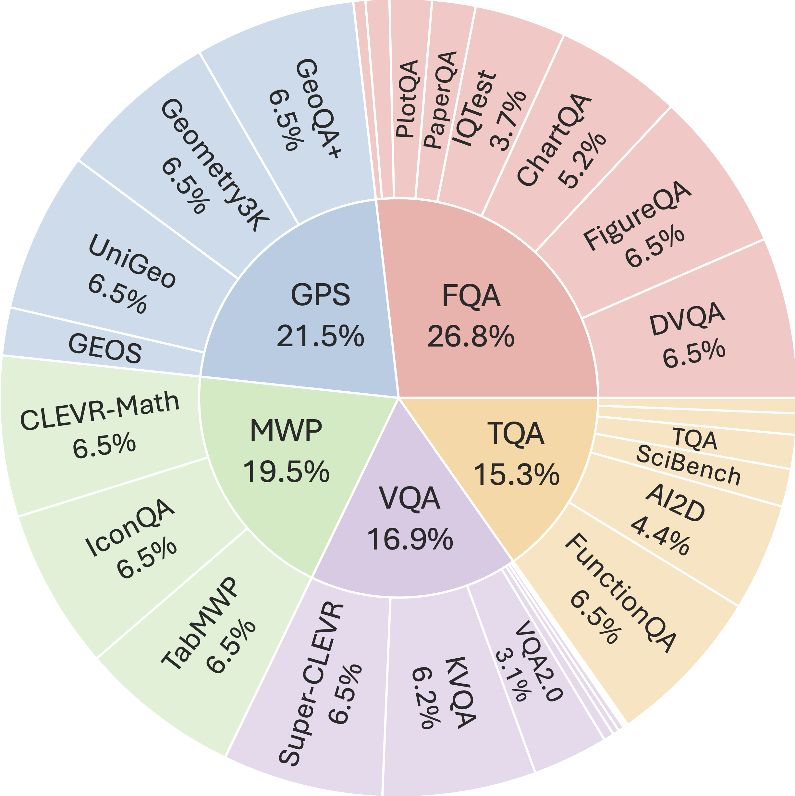
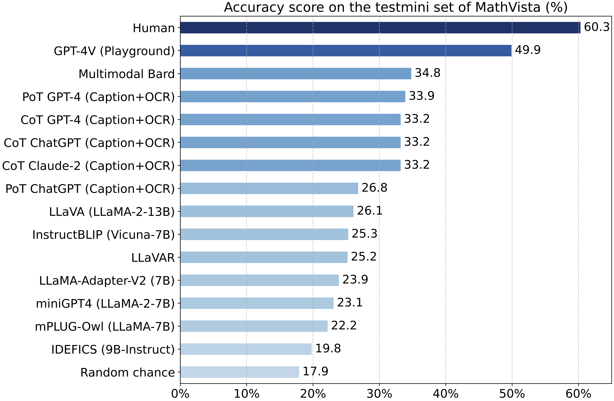
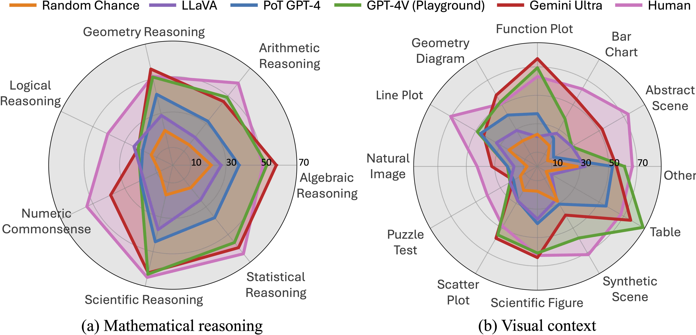
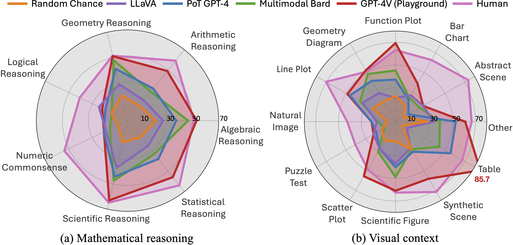
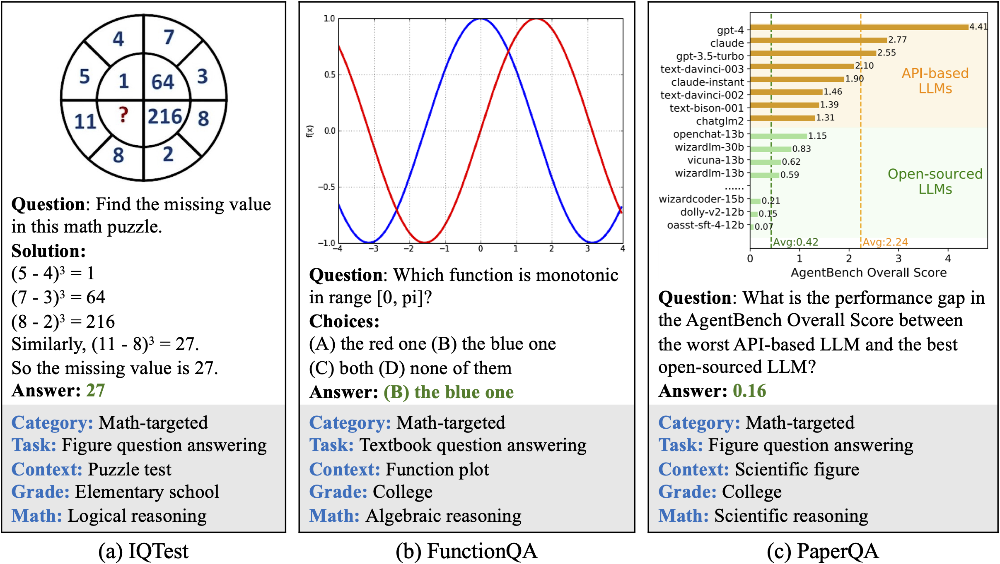

# MathVista: Evaluating Math Reasoning in Visual Contexts

 
 
 
  
 
 
 


Code for the Paper "[MathVista: Evaluating Mathematical Reasoning of Foundation Models in Visual Contexts](https://arxiv.org/abs/2310.02255)".

For more details, please refer to the project page with dataset exploration and visualization tools: [https://mathvista.github.io/](https://mathvista.github.io/).

:bell: If you have any questions or suggestions, please don't hesitate to let us know. You can comment on the [Twitter](https://twitter.com/lupantech/status/1717313355780964608), or post an issue on this repository.

[[Webpage](https://mathvista.github.io/)] [[Paper](https://arxiv.org/abs/2310.02255)] [[Huggingface Dataset](https://huggingface.co/datasets/AI4Math/MathVista)] [[Leaderboard](https://mathvista.github.io/#leaderboard)] [[Visualization](https://mathvista.github.io/#visualization)] [[Result Explorer](https://mathvista.github.io/#explorer)] [[Twitter](https://twitter.com/lupantech/status/1717313355780964608)]

<p align="center">
     <br>
  Tentative logo for <b>MathVista</b>. Generated by DALL·E 3 prompted by 
  <br>"A photo-based logo with a gradient of soft blue and modern typography, accompanied by the title 'MathVista'".
</p>

## Outlines
- [🔦 Spotlight 🔦](https://github.com/lupantech/MathVista/blob/main/README.md#-spotlight-performance-update-sept-12-2024-)
- [💥 News 💥](https://github.com/lupantech/MathVista/blob/main/README.md#-news-)
- [👀 About MathVista](https://github.com/lupantech/MathVista/blob/main/README.md#-about-mathvista)
- [🏆 Leaderboard 🏆](https://github.com/lupantech/MathVista/blob/main/README.md#-leaderboard-)
  - [Contributing the Leaderboard](https://github.com/lupantech/MathVista/blob/main/README.md#contributing-the-leaderboard)
  - [Leaderboard on the testmini subset](https://github.com/lupantech/MathVista/blob/main/README.md#leaderboard-on-the-testmini-subset)
  - [Leaderboard on the test subset](https://github.com/lupantech/MathVista/blob/main/README.md#leaderboard-on-the-test-subset)
- [📊 Dataset Examples](https://github.com/lupantech/MathVista/blob/main/README.md#-dataset-examples)
- [📖 Dataset Usage](https://github.com/lupantech/MathVista/blob/main/README.md#-dataset-usage)
  - [Data Source](https://github.com/lupantech/MathVista/blob/main/README.md#-dataset-usage)
  - [Data Downloading](https://github.com/lupantech/MathVista/blob/main/README.md#data-downloading)
  - [Data Format](https://github.com/lupantech/MathVista/blob/main/README.md#data-format)
  - [Data Visualization](https://github.com/lupantech/MathVista/blob/main/README.md#data-visualization)
  - [Usage Demos](https://github.com/lupantech/MathVista/blob/main/README.md#usage-demos)
- [🔮 Evaluations on MathVista](https://github.com/lupantech/MathVista/blob/main/README.md#-evaluations-on-mathvista)
  - [Requirements (Optional)](https://github.com/lupantech/MathVista/blob/main/README.md#requirements-optional)
  - [Downloading Images (Optional)](https://github.com/lupantech/MathVista/blob/main/README.md#downloading-images-optional)
  - [Evaluation Pipelines](https://github.com/lupantech/MathVista/blob/main/README.md#evaluation-pipelines)
- [📝 Evaluation Scripts of Our Models](https://github.com/lupantech/MathVista/blob/main/README.md#-evaluation-scripts-of-our-models)
  - [Evaluating Multimodal Bard](https://github.com/lupantech/MathVista/blob/main/README.md#evaluating-multimodal-bard)
  - [Evaluating Chain-of-Thought GPT-4](https://github.com/lupantech/MathVista/blob/main/README.md#evaluating-chain-of-thought-gpt-4)
  - [Evaluating Program-of-Thought GPT-4](https://github.com/lupantech/MathVista/blob/main/README.md#evaluating-program-of-thought-gpt-4)
  - [Evaluating More Settings](https://github.com/lupantech/MathVista/blob/main/README.md#evaluating-more-settings)
  - [Evaluating Large Multimodal Models](https://github.com/lupantech/MathVista/blob/main/README.md#evaluating-large-multimodal-models)
- [📈 Evaluation Results](https://github.com/lupantech/MathVista/blob/main/README.md#-evaluation-results)
- [📜 License](https://github.com/lupantech/MathVista/blob/main/README.md#-license)
- [☕ Stay Connected!](https://github.com/lupantech/MathVista/blob/main/README.md#coffee-stay-connected)
- [✅ Cite](https://github.com/lupantech/MathVista/blob/main/README.md#white_check_mark-cite)
- [🧠 Related Work](https://github.com/lupantech/MathVista/blob/main/README.md#-related-work)
- [🤝 Contributors](https://github.com/lupantech/MathVista/blob/main/README.md#-contributors)


## 💥 Spotlight: Performance Update (Sept 12, 2024) 💥

- **Eight models** have now surpassed the average human performance level (based on AMT workers with at least a high school diploma).
- The top performers include:
  - 🥇 **[OpenAI o1](https://openai.com/index/learning-to-reason-with-llms/)**
  - 🥈 **[Grok-2](https://x.ai/blog/grok-2)**
  - 🥉 **[Grok-2 mini](https://x.ai/blog/grok-2)**

## 💥 News 💥
- **[2024.09.12]** 💥 **OpenAI o1 🥇 Sets New SOTA on MathVista with 73.9!** OpenAI’s latest large multimodal model breaks the 70% barrier on **MathVista**, setting a new SOTA. Read more on the [OpenAI blog](https://openai.com/index/learning-to-reason-with-llms/).
- **[2024.06.20]** 💥 **Claude 3.5 Sonnet achieves new SOTA** on MathVista with **67.7**! Learn more at the [Anthropic blog](https://www.anthropic.com/news/claude-3-5-sonnet).
- **[2024.05.13]** 💥 **OpenAI's GPT-4o Outperforms Humans on MathVista!** For the first time, OpenAI's new GPT-4o model has achieved a higher score than the human average on MathVista, scoring **63.8** compared to humans' **60.3**. Learn more at the [OpenAI blog](https://openai.com/index/hello-gpt-4o/).
- **[2024.01.16]** 🌟 Our **MathVista** paper has been accepted for an **Oral** presentation at **ICLR 2024** (only top 85 out of over 7200 submissions)! 🎉 Cheers!
- **[2023.12.21]** 🚀 [Qwen-VL-Plus](https://github.com/QwenLM/Qwen-VL) achieves **43.3%**, establishing itself as the best-performing one in open-sourced models. 🎉 Congratulations!
- **[2023.12.08]** 🔍 We've updated the leaderboard and radar graphs with the **fine-grained scores** of the **Gemini** family models. Thanks to the Gemini Team and Google for providing us with these results! 👏
- **[2023.12.06]** 🚀 Google's newly released multimodal model, [Gemini](https://blog.google/technology/ai/google-gemini-ai/), shows impressive abilities on **MathVista**, achieving a new SOTA performance with **50.3%**! 🎉  Cheers!!
- **[2023.11.17]** 🌟 Congratulations to [SPHINX (V2)](https://github.com/Alpha-VLLM/LLaMA2-Accessory/tree/main/SPHINX), which is now the SOTA open-source multimodal model on **MathVista**, reaching **36.7%**. 👏
- **[2023.10.25]** 🚀 Dive into our comprehensive **112-page** evaluation of **GPT-4V**, Bard, and other Large Multimodal Models, encompassing both **quantitative** and **qualitative** insights. [Explore the full paper now!](https://arxiv.org/abs/2310.02255) 📄✨
- **[2023.10.16]** 🔍 We are working on a comparative study on the **GPT-4V** model. Stay tuned for the detailed report! 📑.
- **[2023.10.15]** We finished the manual evaluation of **GPT-4V** with the playground chatbot on the *testmini* set on **MathVista**. 🚀 GPT-4V achieves a substantial gain of **15.1%** ⬆️ over Bard, reaching a new record of **49.9%**! 🎉
- **[2023.10.15]** Our dataset is now accessible at [Huggingface Datasets](https://huggingface.co/datasets/AI4Math/MathVista).
- **[2023.10.15]** Our dataset is now accessible at [Paper With Code](https://paperswithcode.com/dataset/mathvista).
- **[2023.10.03]** The top-performing model, 🎭 **Multimodal Bard**, achieved a score of **34.8%** on the *testmini* set for **MathVista** 📊.
- **[2023.10.03]** Our work was featured by [Aran Komatsuzaki](https://twitter.com/arankomatsuzaki) on [Twitter](https://twitter.com/arankomatsuzaki/status/1709380140717809992). Thanks!
- **[2023.10.03]** Our paper is now accessible at https://arxiv.org/abs/2310.02255.

## 👀 About MathVista

**Large Language Models (LLMs)** and **Large Multimodal Models (LMMs)** exhibit impressive problem-solving skills in many tasks and domains, but their ability in mathematical reasoning in visual contexts has not been systematically studied. To bridge this gap, we present **MathVista**, a benchmark designed to combine challenges from diverse mathematical and visual tasks. It consists of **6,141 examples**, derived from **28 existing multimodal datasets** involving mathematics and **3 newly created datasets** (i.e., **IQTest, FunctionQA, and PaperQA**). Completing these tasks requires fine-grained, deep visual understanding and compositional reasoning, which all state-of-the-art foundation models find challenging.

<p align="center">
     <br>
  Source dataset distribution of <b>MathVista</b>.
</p>

In October 2023, we conducted **a comprehensive, quantitative evaluation of 12 prominent foundation models** with **MathVista**. The best-performing **GPT-4V** model achieved an overall accuracy of **49.9%**, substantially outperforming Bard, the second-best performer, by **15.1%**. Our in-depth analysis revealed that the superiority of **GPT-4V** is mainly attributed to its enhanced visual perception and mathematical reasoning. However, **GPT-4V** still falls short of human performance by **10.4%**, as it often struggles to understand complex figures and perform rigorous reasoning. This significant gap underscores the critical role that **MathVista** will play in the development of general-purpose AI agents capable of tackling mathematically intensive and visually rich real-world tasks. 

<p align="center">
     <br>
  Accuracy scores the testmini set (1,000 examples) of <b>MathVista</b>.
</p>

We further explore the new ability of **self-verification**, the use of **self-consistency**, and the **goal-directed multi-turn human-AI dialogues**, highlighting the promising potential of GPT-4V for future research.

<p align="center">
     <br>
  Accuracy scores of one leading LLM (i.e., PoT GPT-4), four primary LMMs, random chance, and human performance on <b>MathVista</b>.
</p>

<details>
<summary>🔍 See the accuracy scores without Gemini Ultra</summary>

<p align="center">
     <br>
  Accuracy scores of one leading LLM (i.e., PoT GPT-4), four primary LMMs, random chance, and human performance on <b>MathVista</b>.
</p>

</details>

For more details, you can find our project page [here](https://mathvista.github.io/) and our paper [here](https://arxiv.org/abs/2310.02255).

## 🏆 Leaderboard 🏆

### Contributing the Leaderboard

🚨🚨 The leaderboard is continuously being updated. 

The evaluation instructions are available at [🔮 Evaluations on MathVista](https://github.com/lupantech/MathVista?tab=readme-ov-file#-evaluations-on-mathvista) and [📝 Evaluation Scripts of Our Models](https://github.com/lupantech/MathVista?tab=readme-ov-file#-evaluation-scripts-of-our-models).

To submit your results to the leaderboard on the **testmini** subset, please send to [this email](mailto:lupantech@gmail.com) with your result json file and score json file, referring to the template files below:

- [output_testmini_template_for_leaderboard_submission.json](https://github.com/lupantech/MathVista/blob/main/results/leaderboad_submission_template/output_testmini_template_for_leaderboard_submission.json)
- [scores_testmini_template_for_leaderboard_submission.json](https://github.com/lupantech/MathVista/blob/main/results/leaderboad_submission_template/scores_testmini_template_for_leaderboard_submission.json)

To submit your results to the leaderboard on the **test** subset, please send to [this email](mailto:lupantech@gmail.com) with your result file (**we will generate the score file for you**),  referring to the template file below:

- [output_test_template_for_leaderboard_submission.json](https://github.com/lupantech/MathVista/blob/main/results/leaderboad_submission_template/output_test_template_for_leaderboard_submission.json)

### Leaderboard on the testmini subset

Accuracy scores on the **testmini** subset (1,000 examples):

| **#** | **Model**                            | **Method** | **Source**                                                   | **Date**   | **ALL**  | **FQA** | **GPS** | **MWP** | **TQA** | **VQA** | **ALG** | **ARI** | **GEO** | **LOG** | **NUM** | **SCI** | **STA** |
| ----- | ------------------------------------ | ---------- | ------------------------------------------------------------ | ---------- | -------- | ------- | ------- | ------- | ------- | ------- | ------- | ------- | ------- | ------- | ------- | ------- | ------- |
| -     | **Human Performance\***              | -          | [Link](https://arxiv.org/abs/2310.02255)                     | 2023-10-03 | **60.3** | 59.7    | 48.4    | 73.0    | 63.2    | 55.9    | 50.9    | 59.2    | 51.4    | 40.7    | 53.8    | 64.9    | 63.9    |
| 1     | **OpenAI o1 🥇**                      | LMM 🖼️      | [Link](https://openai.com/index/learning-to-reason-with-llms/) | 2024-09-12 | **73.9** | -       | -       | -       | -       | -       | -       | -       | -       | -       | -       | -       | -       |
| 2     | **Grok-2 🥈**                         | LMM 🖼️      | [Link](https://x.ai/blog/grok-2)                             | 2024-08-13 | **69.0** | -       | -       | -       | -       | -       | -       | -       | -       | -       | -       | -       | -       |
| 3     | **Grok-2 mini 🥉**                    | LMM 🖼️      | [Link](https://x.ai/blog/grok-2)                             | 2024-08-13 | **68.1** | -       | -       | -       | -       | -       | -       | -       | -       | -       | -       | -       | -       |
| 4     | **Claude 3.5 Sonnet**                | LMM 🖼️      | [Link](https://www.anthropic.com/news/claude-3-5-sonnet)     | 2024-06-20 | **67.7** | -       | -       | -       | -       | -       | -       | -       | -       | -       | -       | -       | -       |
| 5     | **LLaVA-OneVision**                  | LMM 🖼️      | [Link](https://llava-vl.github.io/blog/2024-08-05-llava-onevision/) | 2024-08-06 | **67.5** | -       | -       | -       | -       | -       | -       | -       | -       | -       | -       | -       | -       |
| 6     | **InternVL2-Pro**                    | LMM 🖼️      | [Link](https://github.com/OpenGVLab/InternVL)                | 2024-09-04 | **66.8** | 70.6    | 65.4    | 76.9    | 71.5    | 48.0    | 66.5    | 62.3    | 63.6    | 27.0    | 40.3    | 65.6    | 81.1    |
| 7     | **TextGrad (GPT-4o)**                | LMM 🖼️      | [Link](https://github.com/zou-group/textgrad)                | 2024-07-08 | **66.1** | -       | -       | -       | -       | -       | -       | -       | -       | -       | -       | -       | -       |
| 8     | **Gemini 1.5 Pro (May 2024)**        | LMM 🖼️      | [Link](https://storage.googleapis.com/deepmind-media/gemini/gemini_v1_5_report.pdf) | 2024-05-17 | **63.9** | -       | -       | -       | -       | -       | -       | -       | -       | -       | -       | -       | -       |
| 9     | **GPT-4o**                           | LMM 🖼️      | [Link](https://openai.com/index/hello-gpt-4o/)               | 2024-05-13 | **63.8** | -       | -       | -       | -       | -       | -       | -       | -       | -       | -       | -       | -       |
| 10    | **InternVL-Chat-V1.2-Plus**          | LMM 🖼️      | [Link](https://arxiv.org/abs/2312.14238)                     | 2024-02-22 | **59.9** | 51.7    | 61.1    | 79.6    | 52.5    | 57.0    | 54.5    | 63.2    | 61.1    | 16.2    | 48.6    | 55.7    | 60.8    |
| 11    | **Gemini 1.5 Flash (May 2024)**      | LMM 🖼️      | [Link](https://storage.googleapis.com/deepmind-media/gemini/gemini_v1_5_report.pdf) | 2024-05-17 | **58.4** | -       | -       | -       | -       | -       | -       | -       | -       | -       | -       | -       | -       |
| 12    | **GPT-4T 2024-04-09**                | LMM 🖼️      | [Link](https://openai.com/index/hello-gpt-4o/)               | 2024-05-13 | **58.1** | -       | -       | -       | -       | -       | -       | -       | -       | -       | -       | -       | -       |
| 13    | **Pixtral 12B**                      | LMM 🖼️      | [Link](https://x.com/_philschmid/status/1833954941624615151) | 2024-09-11 | **58.0** | -       | -       | -       | -       | -       | -       | -       | -       | -       | -       | -       | -       |
| 14    | **InternLM-XComposer2-VL-7B**        | LMM 🖼️      | [Link](https://github.com/InternLM/InternLM-XComposer)       | 2024-01-22 | **57.6** | 55.0    | 63.0    | 73.7    | 56.3    | 39.7    | 56.6    | 52.4    | 62.3    | 8.1     | 42.4    | 59.0    | 64.1    |
| 15    | **Gemini 1.0 Ultra**                 | LMM 🖼️      | [Link](https://arxiv.org/abs/2312.11805)                     | 2023-12-06 | **53.0** | 49.1    | 56.2    | 53.8    | 69.0    | 40.2    | 58.4    | 45.9    | 55.6    | 21.6    | 38.9    | 62.3    | 59.5    |
| 16    | **Grok-1.5V**                        | LMM 🖼️      | [Link](https://x.ai/blog/grok-1.5v)                          | 2024-04-12 | **52.8** | -       | -       | -       | -       | -       | -       | -       | -       | -       | -       | -       | -       |
| 17    | **Gemini 1.5 Pro (Feb 2024)**        | LMM 🖼️      | [Link](https://storage.googleapis.com/deepmind-media/gemini/gemini_v1_5_report.pdf) | 2024-02-15 | **52.1** | -       | -       | -       | -       | -       | -       | -       | -       | -       | -       | -       | -       |
| 18    | **Claude 3 Opus**                    | LMM 🖼️      | [Link](https://www-cdn.anthropic.com/de8ba9b01c9ab7cbabf5c33b80b7bbc618857627/Model_Card_Claude_3.pdf) | 2024-03-04 | **50.5** | -       | -       | -       | -       | -       | -       | -       | -       | -       | -       | -       | -       |
| 19    | **GPT-4V (Playground)**              | LMM 🖼️      | [Link](https://arxiv.org/abs/2310.02255)                     | 2023-10-15 | **49.9** | 43.1    | 50.5    | 57.5    | 65.2    | 38.0    | 53.0    | 49.0    | 51.0    | 21.6    | 20.1    | 63.1    | 55.8    |
| 20    | **Claude 3 Sonnet**                  | LMM 🖼️      | [Link](https://www-cdn.anthropic.com/de8ba9b01c9ab7cbabf5c33b80b7bbc618857627/Model_Card_Claude_3.pdf) | 2024-03-04 | **47.9** | -       | -       | -       | -       | -       | -       | -       | -       | -       | -       | -       | -       |
| 21    | **InternVL-Chat-V1.2**               | LMM 🖼️      | [Link](https://arxiv.org/abs/2312.14238)                     | 2024-02-22 | **47.7** | 50.9    | 61.1    | 30.6    | 48.1    | 44.7    | 52.3    | 36.5    | 58.2    | 18.9    | 30.6    | 54.9    | 51.8    |
| 22    | **Math-LLaVA-13B**                   | LMM 🖼️      | [Link](http://arxiv.org/abs/2406.17294)                      | 2024-06-25 | **46.6** | 37.2    | 57.7    | 56.5    | 51.3    | 33.5    | 53.0    | 40.2    | 56.5    | 16.2    | 33.3    | 49.2    | 43.9    |
| 23    | **LLaVA-NeXT-34B**                   | LMM 🖼️      | [Link](https://llava-vl.github.io/blog/2024-01-30-llava-1-6/) | 2024-01-30 | **46.5** | -       | -       | -       | -       | -       | -       | -       | -       | -       | -       | -       | -       |
| 24    | **Claude 3 Haiku**                   | LMM 🖼️      | [Link](https://www-cdn.anthropic.com/de8ba9b01c9ab7cbabf5c33b80b7bbc618857627/Model_Card_Claude_3.pdf) | 2024-03-04 | **46.4** | -       | -       | -       | -       | -       | -       | -       | -       | -       | -       | -       | -       |
| 25    | **Gemini 1.0 Pro**                   | LMM 🖼️      | [Link](https://arxiv.org/abs/2312.11805)                     | 2023-12-06 | **45.2** | 47.6    | 40.4    | 39.2    | 61.4    | 39.1    | 45.2    | 38.8    | 41.0    | 10.8    | 32.6    | 54.9    | 56.8    |
| 26    | **Phi-3-Vision-128K-In**             | LMM 🖼️      | [Link](https://huggingface.co/microsoft/Phi-3-vision-128k-instruct) | 2024-05-21 | **44.5** | -       | -       | -       | -       | -       | -       | -       | -       | -       | -       | -       | -       |
| 27    | **Phi-3.5-Vision 4.2B**              | LMM 🖼️      | [Link](https://arxiv.org/abs/2404.14219)                     | 2024-04-22 | **43.9** | -       | -       | -       | -       | -       | -       | -       | -       | -       | -       | -       | -       |
| 28    | **Qwen-VL-Plus**                     | LMM 🖼️      | [Link](https://github.com/QwenLM/Qwen-VL)                    | 2023-12-21 | **43.3** | 54.6    | 38.5    | 31.2    | 55.1    | 34.1    | 39.1    | 32.0    | 39.3    | 18.9    | 26.4    | 59.0    | 56.1    |
| 29    | **Mini-Gemini-HD (Hermes-2-Yi-34B)** | LMM 🖼️      | [Link](https://arxiv.org/abs/2403.18814)                     | 2024-03-27 | **43.3** | -       | -       | -       | -       | -       | -       | -       | -       | -       | -       | -       | -       |
| 30    | **SPHINX-MoE**                       | MoE 🤖      | [Link](https://github.com/Alpha-VLLM/LLaMA2-Accessory/tree/main/SPHINX) | 2024-01-12 | **42.3** | 49.8    | 31.2    | 42.5    | 46.8    | 39.7    | 31.7    | 41.6    | 30.5    | 16.2    | 27.1    | 50.8    | 50.8    |
| 31    | **Mini-Gemini (Mixtral-8x7B)**       | LMM 🖼️      | [Link](https://arxiv.org/abs/2403.18814)                     | 2024-03-27 | **41.8** | -       | -       | -       | -       | -       | -       | -       | -       | -       | -       | -       | -       |
| 32    | **MM1-7B-MoE-Chat**                  | LMM 🖼️      | [Link](https://arxiv.org/abs/2403.09611)                     | 2024-03-14 | **40.9** | -       | -       | -       | -       | -       | -       | -       | -       | -       | -       | -       | -       |
| 33    | **MiniCPM-V-2 (2.8B)**               | LMM 🖼️      | [Link](https://github.com/OpenBMB/MiniCPM-V)                 | 2024-04-14 | **40.6** | 53.2    | 26.0    | 37.1    | 44.3    | 39.1    | 28.5    | 33.1    | 28.0    | 10.8    | 39.6    | 48.4    | 51.8    |
| 34    | **MM1-30B-Chat**                     | LMM 🖼️      | [Link](https://arxiv.org/abs/2403.09611)                     | 2024-03-14 | **39.4** | -       | -       | -       | -       | -       | -       | -       | -       | -       | -       | -       | -       |
| 35    | **SPHINX-Plus**                      | MoE 🤖      | [Link](https://github.com/Alpha-VLLM/LLaMA2-Accessory/tree/main/SPHINX) | 2024-01-12 | **36.8** | -       | -       | -       | -       | -       | -       | -       | -       | -       | -       | -       | -       |
| 36    | **SPHINX (V2)**                      | LMM 🖼️      | [Link](https://github.com/Alpha-VLLM/LLaMA2-Accessory/tree/main/SPHINX) | 2023-11-17 | **36.7** | 54.6    | 16.4    | 23.1    | 41.8    | 43.0    | 20.6    | 33.4    | 17.6    | 24.3    | 21.5    | 43.4    | 51.5    |
| 37    | **MM1-7B-Chat**                      | LMM 🖼️      | [Link](https://arxiv.org/abs/2403.09611)                     | 2024-03-14 | **35.9** | -       | -       | -       | -       | -       | -       | -       | -       | -       | -       | -       | -       |
| 38    | **SPHINX-Intern2**                   | MoE 🤖      | [Link](https://github.com/Alpha-VLLM/LLaMA2-Accessory/tree/main/SPHINX) | 2024-01-12 | **35.5** | -       | -       | -       | -       | -       | -       | -       | -       | -       | -       | -       | -       |
| 39    | **OmniLMM-12B**                      | LMM 🖼️      | [Link](https://github.com/OpenBMB/OmniLMM)                   | 2024-02-01 | **34.9** | 45.0    | 17.8    | 26.9    | 44.9    | 39.1    | 23.1    | 32.3    | 20.9    | 18.9    | 27.8    | 45.9    | 44.2    |
| 40    | **Multimodal Bard**                  | LMM 🖼️      | [Link](https://arxiv.org/abs/2310.02255)                     | 2023-10-03 | **34.8** | 26.0    | 47.1    | 29.6    | 48.7    | 26.8    | 46.5    | 28.6    | 47.8    | 13.5    | 14.9    | 47.5    | 33.0    |
| 41    | **LLaVA-NeXT-Vicuna-7B**             | LMM 🖼️      | [Link](https://llava-vl.github.io/blog/2024-01-30-llava-next/) | 2024-01-30 | **34.6** | -       | -       | -       | -       | -       | -       | -       | -       | -       | -       | -       | -       |
| 42    | **PoT GPT-4 (Caption+OCR)**          | Tool 🛠️     | [Link](https://arxiv.org/abs/2310.02255)                     | 2023-10-03 | **33.9** | 30.1    | 39.4    | 30.6    | 39.9    | 31.3    | 37.4    | 31.7    | 41.0    | 18.9    | 20.1    | 44.3    | 37.9    |
| 43    | **CoT Claude (Caption+OCR)**         | Tool 🛠️     | [Link](https://arxiv.org/abs/2310.02255)                     | 2023-10-03 | **33.2** | 27.5    | 29.3    | 36.0    | 49.4    | 29.1    | 31.0    | 32.9    | 31.0    | 16.2    | 17.4    | 50.8    | 37.2    |
| 44    | **CoT GPT4 (Caption+OCR)**           | Tool 🛠️     | [Link](https://arxiv.org/abs/2310.02255)                     | 2023-10-03 | **33.2** | 27.9    | 31.7    | 31.2    | 51.9    | 28.5    | 33.5    | 30.9    | 32.2    | 13.5    | 12.5    | 58.2    | 37.9    |
| 45    | **CoT ChatGPT (Caption+OCR)**        | Tool 🛠️     | [Link](https://arxiv.org/abs/2310.02255)                     | 2023-10-03 | **33.2** | 26.0    | 31.7    | 35.5    | 48.1    | 30.2    | 32.4    | 32.3    | 33.0    | 16.2    | 17.4    | 54.9    | 36.2    |
| 46    | **MM1-3B-MoE-Chat**                  | LMM 🖼️      | [Link](https://arxiv.org/abs/2403.09611)                     | 2024-03-14 | **32.6** | -       | -       | -       | -       | -       | -       | -       | -       | -       | -       | -       | -       |
| 47    | **MM1-3B-Chat**                      | LMM 🖼️      | [Link](https://arxiv.org/abs/2403.09611)                     | 2024-03-14 | **32.0** | -       | -       | -       | -       | -       | -       | -       | -       | -       | -       | -       | -       |
| 48    | **Gemini 1.0 Nano 2**                | LMM 🖼️      | [Link](https://arxiv.org/abs/2312.11805)                     | 2023-12-06 | **30.6** | 28.6    | 23.6    | 30.6    | 41.8    | 31.8    | 27.1    | 29.8    | 26.8    | 10.8    | 20.8    | 40.2    | 33.5    |
| 49    | **LLaVA-1.5-13B**                    | LMM 🖼️      | [Link](https://llava-vl.github.io/blog/2024-01-30-llava-1-6/) | 2024-01-30 | **27.6** | -       | -       | -       | -       | -       | -       | -       | -       | -       | -       | -       | -       |
| 50    | **SPHINX (V1)**                      | LMM 🖼️      | [Link](https://github.com/Alpha-VLLM/LLaMA2-Accessory/tree/main/SPHINX) | 2023-11-09 | **27.5** | 23.4    | 23.1    | 21.5    | 39.9    | 34.1    | 25.6    | 28.1    | 23.4    | 16.2    | 17.4    | 40.2    | 23.6    |
| 51    | **Gemini 1.0 Nano 1**                | LMM 🖼️      | [Link](https://arxiv.org/abs/2312.11805)                     | 2023-12-06 | **27.3** | 30.9    | 21.6    | 23.7    | 29.1    | 30.7    | 23.8    | 25.5    | 21.3    | 13.5    | 20.8    | 27.9    | 30.9    |
| 52    | **PoT ChatGPT (Caption+OCR)**        | Tool 🛠️     | [Link](https://arxiv.org/abs/2310.02255)                     | 2023-10-03 | **26.8** | 24.5    | 26.4    | 23.7    | 33.5    | 27.9    | 27.8    | 26.1    | 28.0    | 18.9    | 13.2    | 33.6    | 29.9    |
| 53    | **SPHINX-Tiny**                      | MoE 🤖      | [Link](https://github.com/Alpha-VLLM/LLaMA2-Accessory/tree/main/SPHINX) | 2024-01-12 | **26.4** | -       | -       | -       | -       | -       | -       | -       | -       | -       | -       | -       | -       |
| 54    | **LLaVA (LLaMA-2-13B)**              | LMM 🖼️      | [Link](https://arxiv.org/abs/2310.02255)                     | 2023-10-03 | **26.1** | 26.8    | 29.3    | 16.1    | 32.3    | 26.3    | 27.3    | 20.1    | 28.8    | 24.3    | 18.3    | 37.3    | 25.1    |
| 55    | **InstructBLIP (Vicuna-7B)**         | LMM 🖼️      | [Link](https://arxiv.org/abs/2310.02255)                     | 2023-10-03 | **25.3** | 23.1    | 20.7    | 18.3    | 32.3    | 35.2    | 21.8    | 27.1    | 20.7    | 18.9    | 20.4    | 33.0    | 23.1    |
| 56    | **LLaVAR**                           | LMM 🖼️      | [Link](https://arxiv.org/abs/2310.02255)                     | 2023-10-03 | **25.2** | 21.9    | 25.0    | 16.7    | 34.8    | 30.7    | 24.2    | 22.1    | 23.0    | 13.5    | 15.3    | 42.6    | 21.9    |
| 57    | **LLaMA-Adapter-V2 (7B)**            | LMM 🖼️      | [Link](https://arxiv.org/abs/2310.02255)                     | 2023-10-03 | **23.9** | 21.2    | 25.5    | 11.3    | 32.3    | 31.8    | 26.3    | 20.4    | 24.3    | 24.3    | 13.9    | 29.5    | 18.3    |
| 58    | **miniGPT4 (LLaMA-2-7B)**            | LMM 🖼️      | [Link](https://arxiv.org/abs/2310.02255)                     | 2023-10-03 | **23.1** | 18.6    | 26.0    | 13.4    | 30.4    | 30.2    | 28.1    | 21.0    | 24.7    | 16.2    | 16.7    | 25.4    | 17.9    |
| 59    | **mPLUG-Owl (LLaMA-7B)**             | LMM 🖼️      | [Link](https://arxiv.org/abs/2310.02255)                     | 2023-10-03 | **22.2** | 22.7    | 23.6    | 10.2    | 27.2    | 27.9    | 23.6    | 19.2    | 23.9    | 13.5    | 12.7    | 26.3    | 21.4    |
| 60    | **IDEFICS (9B-Instruct)**            | LMM 🖼️      | [Link](https://arxiv.org/abs/2310.02255)                     | 2023-10-03 | **19.8** | 21.6    | 21.1    | 6.5     | 25.9    | 24.0    | 22.1    | 15.0    | 19.8    | 18.9    | 9.9     | 24.6    | 18.1    |
| 61    | **Random Chance**                    | -          | [Link](https://arxiv.org/abs/2310.02255)                     | 2023-10-03 | **17.9** | 15.5    | 24.1    | 4.5     | 23.4    | 24.3    | 25.8    | 13.8    | 22.7    | 13.4    | 8.8     | 15.8    | 14.3    |

Some notations in the table:

- **Human Performance\*:** Average human performance from AMT annotators who have high school diplomas or above.

- **Gemini**: the fine-grained scores are from **the Gemini Team, Google**.

- **GPT-4V (Playground)**: the launched playground at https://chat.openai.com/?model=gpt-4; experimental dates range from Oct 7, 2023, to Oct 15, 2023

- **GPT-4**: the `gpt-4-0613` engine

- **Method types**
  -  **MoE 🤖:** Mixture of Experts
  -  **LMM 🖼️:** Large Multimodal Model
  -  **Tool 🛠️:** Tool-augmented Large Language Model
  
- **Task types:** 
  - **FQA:** figure question answering
  - **GPS:** geometry problem solving
  - **MWP:** math word problem solving
  -  **TQA:** textbook question answering
  - **VQA:** visual question answering
- **Mathematical reasoning types:** 
  - **ALG:** algebraic reasoning
  - **ARI:** arithmetic reasoning
  -  **GEO:** geometry reasoning
  - **LOG:** logical reasoning
  - **NUM:** numeric commonsense reasoning
  - **SCI:** scientific reasoning 
  - **STA:** statistical reasoning

🔔 The automatic evaluation on [CodaLab](https://codalab.org/) are under construction. 


## 📊 Dataset Examples

Examples of our newly annotated datasets: **IQTest**, **FunctionQA**, and **PaperQA**:

<p align="center">
     <br>
</p>

<details>
<summary>🔍 Click to expand/collapse more examples</summary>

Examples of seven mathematical reasoning skills:

1. Arithmetic Reasoning


2. Statistical Reasoning


3. Algebraic Reasoning


4. Geometry Reasoning


5. Numeric Commonsense Reasoning


6. Scientific Reasoning


7. Logical Reasoning


</details>

## 📖 Dataset Usage

### Data Source

The **MathVista** dataset is derived from three newly collected datasets: IQTest, FunctionQA, and Paper, as well as 28 other source datasets. Details can be found in the [source.json](https://huggingface.co/datasets/AI4Math/MathVista/blob/main/source.json) file. All these source datasets have been preprocessed and labeled for evaluation purposes.

### Data Downloading

All the data examples were divided into two subsets: *testmini* and *test*.

- **testmini**: 1,000 examples used for model development, validation, or for those with limited computing resources.
- **test**: 5,141 examples for standard evaluation. Notably, the answer labels for test will NOT be publicly released.

You can download this dataset by the following command (make sure that you have installed [Huggingface Datasets](https://huggingface.co/docs/datasets/quickstart)):

```python
from datasets import load_dataset

dataset = load_dataset("AI4Math/MathVista")
```

Here are some examples of how to access the downloaded dataset:

```python
# print the first example on the testmini set
print(dataset["testmini"][0])
print(dataset["testmini"][0]['pid']) # print the problem id 
print(dataset["testmini"][0]['question']) # print the question text 
print(dataset["testmini"][0]['query']) # print the query text
print(dataset["testmini"][0]['image']) # print the image path
print(dataset["testmini"][0]['answer']) # print the answer
dataset["testmini"][0]['decoded_image'] # display the image

# print the first example on the test set
print(dataset["test"][0])
```

We have uploaded a demo to illustrate how to access the MathVista dataset on Hugging Face, available at [hugging_face_dataset_demo.ipynb](https://github.com/lupantech/MathVista/blob/main/jupyter_notebook_demos/hugging_face_dataset_demo.ipynb).

### Data Format

The dataset is provided in json format and contains the following attributes:

```
{
    "question": [string] The question text,
    "image": [string] A file path pointing to the associated image,
    "choices": [list] Choice options for multiple-choice problems. For free-form problems, this could be a 'none' value,
    "unit": [string] The unit associated with the answer, e.g., "m^2", "years". If no unit is relevant, it can be a 'none' value,
    "precision": [integer] The number of decimal places the answer should be rounded to,
    "answer": [string] The correct answer for the problem,
    "question_type": [string] The type of question: "multi_choice" or "free_form",
    "answer_type": [string] The format of the answer: "text", "integer", "float", or "list",
    "pid": [string] Problem ID, e.g., "1",
    "metadata": {
        "split": [string] Data split: "testmini" or "test",
        "language": [string] Question language: "English", "Chinese", or "Persian",
        "img_width": [integer] The width of the associated image in pixels,
        "img_height": [integer] The height of the associated image in pixels,
        "source": [string] The source dataset from which the problem was taken,
        "category": [string] The category of the problem: "math-targeted-vqa" or "general-vqa",
        "task": [string] The task of the problem, e.g., "geometry problem solving",
        "context": [string] The visual context type of the associated image,
        "grade": [string] The grade level of the problem, e.g., "high school",
        "skills": [list] A list of mathematical reasoning skills that the problem tests
    },
    "query": [string] the query text used as input (prompt) for the evaluation model
}
```

### Data Visualization

🎰 You can explore the dataset in an interactive way [here](https://mathvista.github.io/#visualization).

<details>
<summary>Click to expand/collapse the visualization page screenshot.</summary>

</details>

### Usage Demos

We offer a few demo examples for using the dataset, as follows:

- Use the Bard API for inference: [bard_local_demo.ipynb](https://github.com/lupantech/MathVista/blob/main/jupyter_notebook_demos/bard_local_demo.ipynb)

Stay tuned for more demos coming soon!

## 🔮 Evaluations on MathVista

### Requirements (Optional)

Install the Python dependencies if you would like to reproduce our results for ChatGPT, GPT-4, Claude-2, and Bard:

```sh
pip install openai # for ChatGPT and GPT-4
pip install anthropic # for Claude-2
pip install bardapi # for Bard
```

For more details, please refer to:

- [OpenAI API key](https://platform.openai.com/account/api-keys)
- [Claude API Key](https://docs.anthropic.com/claude/reference/getting-started-with-the-api)
- [Bard API Key](https://bard.google.com/)

If you are considering evaluating your own model, these dependencies might be optional.

### Downloading Images (Optional)

We provide images in the JPG format. You can download and unzip them using the following commands:

```sh
cd data
wget https://huggingface.co/datasets/AI4Math/MathVista/resolve/main/images.zip
unzip images.zip && rm images.zip
```

This step might be optional if you prefer to use the Hugging Face format of the data.

### Evaluation Pipelines

Recent foundation models have been trained to generate longer responses instead of brief text. As such, we propose a new strategy for benchmarking MathVista. This evaluation process comprises three stages:

**(Step 1) Response Generation** ([generate_response.py](https://github.com/lupantech/MathVista/blob/main/evaluation/generate_response.py)): The models generate responses based on the given input query (prompt). This input query integrates the task description, the question, choices, and metadata. Such a design encourage the models yield responses in the desired format, subsequently enhancing the overall evaluation scores. An example of such an input query is:

```
Hint: Please answer the question and provide the correct option letter, e.g., A, B, C, D, at the end.
Question: Find $m\\angle H$
Choices:
(A) 97
(B) 102
(C) 107
(D) 122
```

The task description is defined as follows:

| Question type   | Answer type | Task instruction                                             |
| --------------- | ----------- | ------------------------------------------------------------ |
| Multiple-choice | Text        | Please answer the question and provide the correct option letter, e.g., A, B, C, D, at the end. |
| Free-form       | Integer     | Please answer the question requiring an integer answer and provide the final value, e.g., 1, 2, 3, at the end. |
| Free-form       | Float (1)   | Please answer the question requiring a floating-point number with one decimal place and provide the final value, e.g., 1.2, 1.3, 1.4, at the end. |
| Free-form       | Float (2)   | Please answer the question requiring a floating-point number with two decimal places and provide the final value, e.g., 1.23, 1.34, 1.45, at the end. |
| Free-form       | List        | Please answer the question requiring a Python list as an answer and provide the final list, e.g., [1, 2, 3], [1.2, 1.3, 1.4], at the end. |

**(Step 2) Answer Extraction** ([extract_answer.py](https://github.com/lupantech/MathVista/blob/main/evaluation/extract_answer.py)): Next, the short answer text is extracted from the detailed response. We propose an answer extractor based on LLMs such as GPT-4. A preliminary study of 200 examples shows that GPT-4 can extract the answer text with more than 99.5% accuracy. Below are examples of extracting short answers from long responses:

```
# Example 1
Hint: Please answer the question requiring an integer answer and provide the final value,
e.g., 1, 2, 3, at the end.
Question: Which number is missing?

Model response: The number missing in the sequence is 14.

Extracted answer: 14

# Example 2
Hint: Please answer the question and provide the correct option letter, e.g., A, B, C,
D, at the end.
Question: What fraction of the shape is blue?
Choices: 
(A) 3/11 
(B) 8/11 
(C) 6/11 
(D) 3/5

Model response: The correct answer is (B) 8/11.

Extracted answer: B
```

**(Step 3) Score Calculation** ([calculate_score.py](https://github.com/lupantech/MathVista/blob/main/evaluation/extract_answer.py)): Finally, the extracted answer is normalized to a required answer format (e.g., an option letter or an integer), and the target metric scores are computed.

## 📝 Evaluation Scripts of Our Models

To execute the evaluation scripts in our paper, ensure your `data` folder has the following structure:

```
├── query.json
├── test.json
├── testmini.json
├── images
    ├── 1.jpg
    ├── 2.jpg
    └── ...
└── texts
    ├── captions_bard.json
    └── ocrs_easyocr.json
```

Additionally, ensure that the API keys for ChatGPT, GPT-4, Claude-2, and Bard are properly set up.

### Evaluating Multimodal Bard

If you have setted Multimodal Bard, you can run the following commands:

Generate the response on the **testmini** subset:

```sh
cd evaluation

python generate_response.py \
--model bard \
--output_dir ../results/bard \
--output_file output_bard.json
```

Extract the short answer text for score calculation on the **testmini** subset:

```sh
python extract_answer.py \
--output_dir ../results/bard \
--output_file output_bard.json 
```

Calculate the final score on the **testmini** subset:

```sh
python calculate_score.py \
--output_dir ../results/bard \
--output_file output_bard.json \
--score_file scores_bard.json
```

Generate the response of the **test** subset:

```sh
python generate_response.py \
--model bard \
--input_file test.json \
--output_dir ../results/bard \
--output_file output_bard_test.json
```

Extract the short answer text for score calculation on the **test** subset:

```sh
python extract_answer.py \
--output_dir ../results/bard \
--output_file output_bard_test.json 
```

### Evaluating Chain-of-Thought GPT-4

Generate the response on the **testmini** subset:

```sh
cd evaluation

python generate_response.py \
--model gpt-4-0613 \
--output_dir ../results/gpt4 \
--output_file output_gpt4_2shot_solution_use_caption_ocr.json \
--shot_num 2 \
--shot_type solution \
--use_caption \
--use_ocr \
--caption_file ../data/texts/captions_bard.json \
--ocr_file ../data/texts/ocrs_easyocr.json 
```

Extract the short answer text for score calculation on the **testmini** subset:

```sh
python extract_answer.py \
--output_dir ../results/gpt4 \
--output_file output_gpt4_2shot_solution_use_caption_ocr.json
```

Calculate the final score on the **testmini** subset:

```sh
python calculate_score.py \
--output_dir ../results/gpt4 \
--output_file output_gpt4_2shot_solution_use_caption_ocr.json \
--score_file scores_gpt4_2shot_solution_use_caption_ocr.json
```

Generate the response of the **test** subset:

```sh
python generate_response.py \
--model gpt-4-0613 \
-input_file test.json \
--output_dir ../results/gpt4 \
--output_file output_test_gpt4_2shot_code_use_caption_ocr.json \
--shot_num 2 \
--shot_type solution \
--use_caption \
--use_ocr \
--caption_file ../data/texts/captions_bard.json \
--ocr_file ../data/texts/ocrs_easyocr.json 
```

Extract the short answer text for score calculation on the **test** subset:

```sh
python extract_answer.py \
--output_dir ../results/bard \
--output_file output_test_gpt4_2shot_code_use_caption_ocr.json 
```

### Evaluating Program-of-Thought GPT-4

Generate the response on the **testmini** subset:

```sh
cd evaluation

python generate_response.py \
--model gpt-4-0613 \
--output_dir ../results/gpt4 \
--output_file output_gpt4_2shot_code_use_caption_ocr.json \
--shot_num 2 \
--shot_type code \
--use_caption \
--use_ocr \
--caption_file ../data/texts/captions_bard.json \
--ocr_file ../data/texts/ocrs_easyocr.json 
```

Extract the short answer text for score calculation on the **testmini** subset:

```sh
python extract_answer.py \
--output_dir ../results/gpt4 \
--output_file output_gpt4_2shot_code_use_caption_ocr.json \
--response_label execution
```

Calculate the final score on the **testmini** subset:

```sh
python calculate_score.py \
--output_dir ../results/gpt4 \
--output_file output_gpt4_2shot_code_use_caption_ocr.json \
--score_file scores_gpt4_2shot_code_use_caption_ocr.json
```

Generate the response of the **test** subset:

```sh
python generate_response.py \
--model gpt-4-0613 \
--input_file test.json \
--output_dir ../results/gpt4 \
--output_file output_test_gpt4_2shot_code_use_caption_ocr.json \
--shot_num 2 \
--shot_type code \
--use_caption \
--use_ocr \
--caption_file ../data/texts/captions_bard.json \
--ocr_file ../data/texts/ocrs_easyocr.json 
```

Extract the short answer text for score calculation on the **test** subset:

```sh
python extract_answer.py \
--output_dir ../results/gpt4 \
--output_file output_test_gpt4_2shot_code_use_caption_ocr.json \
--response_label execution
```

### Evaluating More Settings

For additional settings for large language models and other baselines, please refer to the running scripts available in the [`scripts`](https://github.com/lupantech/MathVista/tree/main/scripts) directory.

### Evaluating Large Multimodal Models

We thank [Hritik Bansal](https://sites.google.com/view/hbansal) and the [VisIT-Bench](https://github.com/mlfoundations/VisIT-Bench/tree/main) project for providing easy-to-use [codes](https://github.com/mlfoundations/VisIT-Bench/tree/main/baselines) for evaluating most of the large multimodal models included in our paper.

## 📈 Evaluation Results

<details>
<summary>Click to expand/collapse the examples.</summary>

</details>

<details>
<summary>Click to expand/collapse the examples.</summary>

</details>

<details>
<summary>Click to expand/collapse the example.</summary>

</details>

<details>
<summary>Click to expand/collapse the example.</summary>

</details>

<details>
<summary>Click to expand/collapse the example.</summary>

</details>

<details>
<summary>Click to expand/collapse the example.</summary>

</details>
We stored the result files from different models in the [results](https://github.com/lupantech/MathVista/tree/main/results/) directory.

🐙 For visualization of these results, visit our [exploration](https://mathvista.github.io/#explorer) page.

## 📜 License

The new contributions to our dataset are distributed under the [CC BY-SA 4.0](https://creativecommons.org/licenses/by-sa/4.0/) license, including

- The creation of three dataset: IQTest, FunctionQA, and Paper;
- The filtering and cleaning of source datasets;
- The standard formalization of instances for evaluation purposes;
- The annotations of metadata.

The copyright of the images and the questions belongs to the original authors, and the source of every image and original question can be found in the `metadata` field and in the [source.json](https://huggingface.co/datasets/AI4Math/MathVista/blob/main/source.json) file. Alongside this license, the following conditions apply:

- **Purpose:** The dataset was primarily designed for use as a test set.
- **Commercial Use:** The dataset can be used commercially as a test set, but using it as a training set is prohibited. By accessing or using this dataset, you acknowledge and agree to abide by these terms in conjunction with the [CC BY-SA 4.0](https://creativecommons.org/licenses/by-sa/4.0/) license.

## :coffee: Stay Connected!

Fantastic! I'm always open to engaging discussions, collaborations, or even just sharing a virtual coffee. To get in touch, visit [Pan Lu](https://lupantech.github.io/)'s homepage for contact information.


## :white_check_mark: Cite

If you find **MathVista** useful for your your research and applications, please kindly cite using this BibTeX:

```latex
@inproceedings{lu2024mathvista,
  title={MathVista: Evaluating Mathematical Reasoning of Foundation Models in Visual Contexts},
  author={Lu, Pan and Bansal, Hritik and Xia, Tony and Liu, Jiacheng and Li, Chunyuan and Hajishirzi, Hannaneh and Cheng, Hao and Chang, Kai-Wei and Galley, Michel and Gao, Jianfeng},
  booktitle={International Conference on Learning Representations (ICLR)},
  year={2024}
}
```

## 🧠 Related Work

Explore our additional research on **large language models** and **large multimodal models** , focusing on mathematical reasoning, scientific reasoning, and multimodal reasoning:

- **[Chameleon]** [Chameleon: Plug-and-Play Compositional Reasoning with Large Language Models](https://chameleon-llm.github.io/)
- **[ScienceQA]** [Learn to Explain: Multimodal Reasoning via Thought Chains for Science Question Answering](https://scienceqa.github.io/)
- **[LLaMA-Adapter]** [LLaMA-Adapter: Efficient Fine-tuning of Language Models with Zero-init Attention](https://github.com/OpenGVLab/LLaMA-Adapter)
- **[LLaMA-Adapter V2]** [LLaMA-Adapter V2: Parameter-Efficient Visual Instruction Model](https://github.com/OpenGVLab/LLaMA-Adapter)
- **[DL4MATH]** [A Survey of Deep Learning for Mathematical Reasoning](https://arxiv.org/abs/2212.10535)
- **[PromptPG]** [Dynamic Prompt Learning via Policy Gradient for Semi-structured Mathematical Reasoning](https://promptpg.github.io/)
- **[SciBench]** [SciBench: Evaluating College-Level Scientific Problem-Solving Abilities of Large Language Models](https://arxiv.org/abs/2307.10635)
- **[TheoremQA]** [TheoremQA: A Theorem-driven Question Answering dataset](https://arxiv.org/abs/2305.12524)
- **[Līla]** [A Unified Benchmark for Mathematical Reasoning](https://lila.apps.allenai.org/)
- **[IconQA]** [IconQA: A New Benchmark for Abstract Diagram Understanding and Visual Language Reasoning](https://iconqa.github.io/)
- **[Inter-GPS]** [Inter-GPS: Interpretable Geometry Problem Solving with Formal Language and Symbolic Reasoning](https://lupantech.github.io/inter-gps/)

## 🤝 Contributors

Here are the key contributors to this project:

[Pan Lu](https://lupantech.github.io/)<sup>1</sup>, [Hritik Bansal](https://sites.google.com/view/hbansal)<sup>1</sup>, [Tony Xia](https://tonyxia2001.github.io/)<sup>1</sup>, [Jiacheng Liu](https://liujch1998.github.io/)<sup>2</sup>, [Chunyuan Li](https://chunyuan.li/)<sup>3</sup>, [Hannaneh Hajishirzi](https://homes.cs.washington.edu/~hannaneh/)<sup>2</sup>, [Hao Cheng](https://sites.google.com/site/hcheng2site/Home)<sup>3</sup>, [Kai-Wei Chang](http://web.cs.ucla.edu/~kwchang/)<sup>1</sup>, [Michel Galley](https://www.microsoft.com/en-us/research/people/mgalley/?from=https://research.microsoft.com/~mgalley&type=exact)<sup>3</sup>, [Jianfeng Gao](https://www.microsoft.com/en-us/research/people/jfgao/)<sup>3</sup>

<sup>1</sup>University of California, Los Angeles, <sup>2</sup>University of Washington, <sup>3</sup>Microsoft Research
