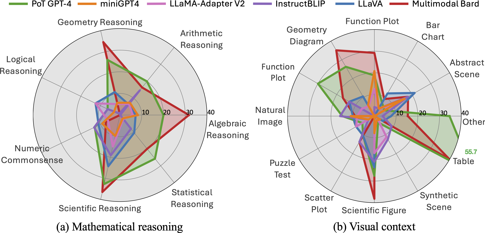

# MathVista: Evaluating Mathematical Reasoning of Foundation Models in Visual Contexts

 
 
 
  
 
 
 


Code for the Paper "[MathVista: Evaluating Mathematical Reasoning of Foundation Models in Visual Contexts](https://arxiv.org/abs/2310.02255)".

For more details, please refer to the project page with dataset exploration and visualization tools: [https://mathvista.github.io/](https://mathvista.github.io/).

:bell: If you have any questions or suggestions, please don't hesitate to let us know. You can comment on the [Twitter](https://twitter.com/lupantech/status/1709757360758288448), or post an issue on this repository.

[[Webpage](https://mathvista.github.io/)] [[Paper](https://arxiv.org/abs/2310.02255)] [[Huggingface Dataset](https://huggingface.co/datasets/AI4Math/MathVista)] [[Leaderboard](https://mathvista.github.io/#leaderboard)] [[Visualization](https://mathvista.github.io/#visualization)] [[Result Explorer](https://mathvista.github.io/#explorer)] [[Twitter](https://twitter.com/lupantech/status/1709757360758288448)]

<p align="center">
     <br>
  Tentative logo for <b>MathVista</b>.
</p>

## 💥 News 💥

- **[2023.10.16]** 🔍 We are working on a comparative study on the **GPT-4V** model. Stay tuned for the detailed report! 📑.
- **[2023.10.15]** We finished the manual evaluation of **GPT-4V** with the playground chatbot on the *testmini* set on **MathVista**. 🚀 GPT-4V achieves a substantial gain of **15.1%** ⬆️ over Bard, reaching a new record of **49.9%**! 🎉
- **[2023.10.15]** Our dataset is now accessible at [Huggingface Datasets](https://huggingface.co/datasets/AI4Math/MathVista).
- **[2023.10.15]** Our dataset is now accessible at [Paper With Code](https://paperswithcode.com/dataset/mathvista).
- **[2023.10.03]** The top-performing model, 🎭 **Multimodal Bard**, achieved a score of **34.8%** on the *testmini* set for **MathVista** 📊.
- **[2023.10.03]** Our work was featured by [Aran Komatsuzaki](https://twitter.com/arankomatsuzaki) on [Twitter](https://twitter.com/arankomatsuzaki/status/1709380140717809992). Thanks!
- **[2023.10.03]** Our paper is now accessible at https://arxiv.org/abs/2310.02255.

## About MathVista

We present **MathVista**, a benchmark designed to amalgamate challenges from **diverse mathematical and visual tasks**. We first taxonomize the key task types, reasoning skills, and visual contexts from the literature to guide our selection from **28 existing math-focused and visual question answering datasets**. Then, **we construct three new datasets, IQTest, FunctionQA, and PaperQA**, to accommodate for missing types of visual contexts. The problems featured often require deep visual understanding beyond OCR or image captioning, and compositional reasoning with rich domain-specific tools, thus posing a notable challenge to existing models.

<p align="center">
     <br>
  Source dataset distribution of <b>MathVista</b>.
</p>


We conduct **a comprehensive evaluation of 11 prominent open-source and proprietary foundation models** (LLMs, LLMs augmented with tools, and LMMs), and **early experiments with GPT-4V**. The best-performing model, Multimodal Bard, achieves only **58%** of human performance (34.8% vs 60.3%), indicating ample room for further improvement. Given this significant gap, **MathVista** fuels future research in the development of general-purpose AI agents capable of tackling mathematically intensive and visually rich real-world tasks. Preliminary tests show that **MathVista** also presents challenges to GPT-4V, underscoring the benchmark's importance.

<p align="center">
     <br>
  Accuracy scores of one leading LLM (PoT GPT-4) and five primary LMMs on <b>MathVista</b>.
</p>


For more details, you can find our project page [here](https://mathvista.github.io/) and our paper [here](https://arxiv.org/pdf/2310.02255.pdf).

## 🏆 Leaderboard 🏆

🚨 The leaderboard is continuously being updated. To submit your results to the leaderboard, please send to [this mail](mailto:lupantech@gmail.com) with your result json file (the result [template](https://github.com/lupantech/MathVista/blob/main/results/output_testmini_template_for_leaderboard_submission.json) for *testmini* and the [template](https://github.com/lupantech/MathVista/blob/main/results/output_test_template_for_leaderboard_submission.json) for *test*).

Accuracy scores on the **testmini** subset (1,000 examples):

| **#** | **Model**                            | **Method** | **Source**                               | **Date**   | **ALL**  | **FQA** | **GPS** | **MWP** | **TQA** | **VQA** | **ALG** | **ARI** | **GEO** | **LOG** | **NUM** | **SCI** | **STA** |
| ----- | ------------------------------------ | ---------- | ---------------------------------------- | ---------- | -------- | ------- | ------- | ------- | ------- | ------- | ------- | ------- | ------- | ------- | ------- | ------- | ------- |
| -     | **Human**                            | -          | [Link](https://arxiv.org/abs/2310.02255) | 2023-10-03 | **60.3** | 59.7    | 48.4    | 73.0    | 63.2    | 55.9    | 50.9    | 59.2    | 51.4    | 40.7    | 53.8    | 64.9    | 63.9    |
| 1     | **<u>GPT-4V (Playgroud)</u>🥇**       | LMM 🖼️      | [Link](https://arxiv.org/abs/2310.02255) | 2023-10-15 | **49.9** | 43.1    | 50.5    | 57.5    | 65.2    | 38.0    | 53.0    | 49.0    | 51.0    | 21.6    | 20.1    | 63.1    | 55.8    |
| 2     | **<u>Multimodal Bard</u> 🥈**         | LMM 🖼️      | [Link](https://arxiv.org/abs/2310.02255) | 2023-10-03 | **34.8** | 26.0    | 47.1    | 29.6    | 48.7    | 26.8    | 46.5    | 28.6    | 47.8    | 13.5    | 14.9    | 47.5    | 33.0    |
| 3     | **<u>PoT GPT-4 (Caption+OCR)</u> 🥉** | Tool 🛠️     | [Link](https://arxiv.org/abs/2310.02255) | 2023-10-03 | **33.9** | 30.1    | 39.4    | 30.6    | 39.9    | 31.3    | 37.4    | 31.7    | 41.0    | 18.9    | 20.1    | 44.3    | 37.9    |
| 4     | **CoT GPT-4 (Caption+OCR)**          | Tool 🛠️     | [Link](https://arxiv.org/abs/2310.02255) | 2023-10-03 | **33.2** | 27.9    | 31.7    | 31.2    | 51.9    | 28.5    | 33.5    | 30.9    | 32.2    | 13.5    | 12.5    | 58.2    | 37.9    |
| 5     | **CoT ChatGPT (Caption+OCR)**        | Tool 🛠️     | [Link](https://arxiv.org/abs/2310.02255) | 2023-10-03 | **33.2** | 27.5    | 29.3    | 36.0    | 49.4    | 29.1    | 31.0    | 32.9    | 31.0    | 16.2    | 17.4    | 50.8    | 37.2    |
| 6     | **CoT Claude-2 (Caption+OCR)**       | Tool 🛠️     | [Link](https://arxiv.org/abs/2310.02255) | 2023-10-03 | **33.2** | 26.0    | 31.7    | 35.5    | 48.1    | 30.2    | 32.4    | 32.3    | 33.0    | 16.2    | 17.4    | 54.9    | 36.2    |
| 7     | **PoT ChatGPT (Caption+OCR)**        | Tool 🛠️     | [Link](https://arxiv.org/abs/2310.02255) | 2023-10-03 | **26.8** | 24.5    | 26.4    | 23.7    | 33.5    | 27.9    | 27.8    | 26.1    | 28.0    | 18.9    | 13.2    | 33.6    | 29.9    |
| 8     | **LLaVA (LLaMA-2-13B)**              | LMM 🖼️      | [Link](https://arxiv.org/abs/2310.02255) | 2023-10-03 | **26.1** | 26.8    | 29.3    | 16.1    | 32.3    | 26.3    | 27.3    | 20.1    | 28.8    | 24.3    | 18.3    | 37.3    | 25.1    |
| 9     | **InstructBLIP (Vicuna-7B)**         | LMM 🖼️      | [Link](https://arxiv.org/abs/2310.02255) | 2023-10-03 | **25.3** | 23.1    | 20.7    | 18.3    | 32.3    | 35.2    | 21.8    | 27.1    | 20.7    | 18.9    | 20.4    | 33.0    | 23.1    |
| 10    | **LLaVAR**                           | LMM 🖼️      | [Link](https://arxiv.org/abs/2310.02255) | 2023-10-03 | **25.2** | 21.9    | 25.0    | 16.7    | 34.8    | 30.7    | 24.2    | 22.1    | 23.0    | 13.5    | 15.3    | 42.6    | 21.9    |
| 11    | **LLaMA-Adapter-V2 (7B)**            | LMM 🖼️      | [Link](https://arxiv.org/abs/2310.02255) | 2023-10-03 | **23.9** | 21.2    | 25.5    | 11.3    | 32.3    | 31.8    | 26.3    | 20.4    | 24.3    | 24.3    | 13.9    | 29.5    | 18.3    |
| 12    | **miniGPT4 (LLaMA-2-7B)**            | LMM 🖼️      | [Link](https://arxiv.org/abs/2310.02255) | 2023-10-03 | **23.1** | 18.6    | 26.0    | 13.4    | 30.4    | 30.2    | 28.1    | 21.0    | 24.7    | 16.2    | 16.7    | 25.4    | 17.9    |
| 13    | **mPLUG-Owl (LLaMA-7B)**             | LMM 🖼️      | [Link](https://arxiv.org/abs/2310.02255) | 2023-10-03 | **22.2** | 22.7    | 23.6    | 10.2    | 27.2    | 27.9    | 23.6    | 19.2    | 23.9    | 13.5    | 12.7    | 26.3    | 21.4    |
| 14    | **IDEFICS (9B-Instruct)**            | LMM 🖼️      | [Link](https://arxiv.org/abs/2310.02255) | 2023-10-03 | **19.8** | 21.6    | 21.1    | 6.5     | 25.9    | 24.0    | 22.1    | 15.0    | 19.8    | 18.9    | 9.9     | 24.6    | 18.1    |
| 15    | **Random Chance**                    | -          | [Link](https://arxiv.org/abs/2310.02255) | 2023-10-03 | **17.9** | 18.2    | 21.6    | 3.8     | 19.6    | 26.3    | 21.7    | 14.7    | 20.1    | 13.5    | 8.3     | 17.2    | 16.3    |

Some notations in the table:

- **GPT-4V (Playgroud)**: the launched playground at https://chat.openai.com/?model=gpt-4; experimental dates range from Oct 7, 2023, to Oct 15, 2023

- **GPT-4**: the `gpt-4-0613` engine

- **Method types**
  -  **LMM 🖼️:** Large Multimodal Model
  -  **Tool 🛠️:** Tool-augmented Large Language Model

- **Task types:** 
  - **FQA:** figure question answering
  - **GPS:** geometry problem solving
  - **MWP:** math word problem solving
  -  **TQA:** textbook question answering
  - **VQA:** visual question answering
- **Mathematical reasoning types:** 
  - **ALG:** algebraic reasoning
  - **ARI:** arithmetic reasoning
  -  **GEO:** geometry reasoning
  - **LOG:** logical reasoning
  - **NUM:** numeric commonsense reasoning
  - **SCI:** scientific reasoning 
  - **STA:** statistical reasoning

🔔 The leaderboard for the *test* set (5,141 examples) and the automatic evaluation on [CodaLab](https://codalab.org/) are under construction. 


## Dataset Examples

Examples of our newly annotated datasets: IQTest, FunctionQA, and PaperQA:


<details>
<summary>🔍 Click to expand/collapse more examples</summary>

Examples of seven mathematical reasoning skills:

1. Arithmetic Reasoning


2. Statistical Reasoning


3. Algebraic Reasoning


4. Geometry Reasoning


5. Numeric Commonsense Reasoning


6. Scientific Reasoning


7. Logical Reasoning


</details>

## Dataset Usage

### Data Downloading

All the data examples were divided into two subsets: *testmini* and *test*.

- **testmini**: 1,000 examples used for model development, validation, or for those with limited computing resources.
- **test**: 5,141 examples for standard evaluation. Notably, the answer labels for test will NOT be publicly released.

You can download this dataset by the following command (make sure that you have installed [Huggingface Datasets](https://huggingface.co/docs/datasets/quickstart)):

```python
from datasets import load_dataset

dataset = load_dataset("AI4Math/MathVista")
```

Here are some examples of how to access the downloaded dataset:

```python
# print the first example on the testmini set
print(dataset["testmini"][0])
print(dataset["testmini"][0]['pid']) # print the problem id 
print(dataset["testmini"][0]['question']) # print the question text 
print(dataset["testmini"][0]['query']) # print the query text
print(dataset["testmini"][0]['image']) # print the image path
print(dataset["testmini"][0]['answer']) # print the answer
dataset["testmini"][0]['decoded_image'] # display the image

# print the first example on the test set
print(dataset["test"][0])
```

We provide the jpg format of the images. You can download and zip them by:

```sh
cd data
wget https://huggingface.co/datasets/AI4Math/MathVista/resolve/main/images.zip
unzip & rm images.zip
```

### Data Format

The dataset is provided in json format and contains the following attributes:

```
{
    "question": [string] The question text,
    "image": [string] A file path pointing to the associated image,
    "choices": [list] Choice options for multiple-choice problems. For free-form problems, this could be a 'none' value,
    "unit": [string] The unit associated with the answer, e.g., "m^2", "years". If no unit is relevant, it can be a 'none' value,
    "precision": [integer] The number of decimal places the answer should be rounded to,
    "answer": [string] The correct answer for the problem,
    "question_type": [string] The type of question: "multi_choice" or "free_form",
    "answer_type": [string] The format of the answer: "text", "integer", "float", or "list",
    "pid": [string] Problem ID, e.g., "1",
    "metadata": {
        "split": [string] Data split: "testmini" or "test",
        "language": [string] Question language: "English", "Chinese", or "Persian",
        "img_width": [integer] The width of the associated image in pixels,
        "img_height": [integer] The height of the associated image in pixels,
        "source": [string] The source dataset from which the problem was taken,
        "category": [string] The category of the problem: "math-targeted-vqa" or "general-vqa",
        "task": [string] The task of the problem, e.g., "geometry problem solving",
        "context": [string] The visual context type of the associated image,
        "grade": [string] The grade level of the problem, e.g., "high school",
        "skills": [list] A list of mathematical reasoning skills that the problem tests
    },
    "query": [string] the query text used as input (prompt) for the evaluation model
}
```

### Data Visualization

🎰 You can explore the dataset in an interactive way [here](https://mathvista.github.io/#visualization).

<details>
<summary>Click to expand/collapse the visualization page screeshot.</summary>

</details>

### Data Source

The **MathVista** dataset is derived from three newly collected datasets: IQTest, FunctionQA, and Paper, as well as 28 other source datasets. Details can be found in the [source.json](https://huggingface.co/datasets/AI4Math/MathVista/blob/main/source.json) file. All these source datasets have been preprocessed and labeled for evaluation purposes.

## 🐙 Requirements

- [OpenAI API key](https://platform.openai.com/account/api-keys)
- [Claude API Key](https://docs.anthropic.com/claude/reference/getting-started-with-the-api)
- [Bard API Key](https://bard.google.com/)

Install the python dependencies if you would like to reproduce our results:

```
pip install openai
pip install anthropic
pip install bardapi
```

## Run Experiments on MathVista

### Multimodal Bard

If you have setted Multimodal Bard, you can run the following commands:

Generate the response:

```sh
cd evaluation

python generate_response.py \
--model bard \
--output_dir ../results/bard \
--output_file output_bard.json
```

Extract the short answer text for score calculation:

```sh
python extract_answer.py \
--output_dir ../results/bard \
--output_file output_bard.json 
```

Calculate the final score:

```sh
python calculate_score.py \
--output_dir ../results/bard \
--output_file output_bard.json \
--score_file scores_bard.json
```

### Chain-of-Thought GPT-4

Generate the response:

```sh
cd evaluation

python generate_response.py \
--model gpt-4-0613 \
--output_dir ../results/gpt4 \
--output_file output_gpt4_2shot_solution_use_caption_ocr.json \
--shot_num 2 \
--shot_type solution \
--use_caption \
--use_ocr \
--caption_file ../data/texts/captions_bard.json \
--ocr_file ../data/texts/ocrs_easyocr.json 
```

Extract the short answer text for score calculation:

```sh
python extract_answer.py \
--output_dir ../results/gpt4 \
--output_file output_gpt4_2shot_solution_use_caption_ocr.json
```

Calculate the final score:

```sh
python calculate_score.py \
--output_dir ../results/gpt4 \
--output_file output_gpt4_2shot_solution_use_caption_ocr.json \
--score_file scores_gpt4_2shot_solution_use_caption_ocr.json
```

### Program-of-Thought GPT-4

Generate the response:

```sh
cd evaluation

python generate_response.py \
--model gpt-4-0613 \
--output_dir ../results/gpt4 \
--output_file output_gpt4_2shot_code_use_caption_ocr.json \
--shot_num 2 \
--shot_type code \
--use_caption \
--use_ocr \
--caption_file ../data/texts/captions_bard.json \
--ocr_file ../data/texts/ocrs_easyocr.json 
```

Extract the short answer text for score calculation:

```sh
python extract_answer.py \
--output_dir ../results/gpt4 \
--output_file output_gpt4_2shot_code_use_caption_ocr.json \
--response_label execution
```

Calculate the final score:

```sh
python calculate_score.py \
--output_dir ../results/gpt4 \
--output_file output_gpt4_2shot_code_use_caption_ocr.json \
--score_file scores_gpt4_2shot_code_use_caption_ocr.json
```

### More Models

To run more models, please check out the running scripts at [`scripts`](https://github.com/lupantech/MathVista/tree/main/scripts).

## License

The new contributions to our dataset are distributed under the [CC BY-SA 4.0](https://creativecommons.org/licenses/by-sa/4.0/) license, including

- The creation of three dataset: IQTest, FunctionQA, and Paper;
- The filtering and cleaning of source datasets;
- The standard formalization of instances for evaluation purposes;
- The annotations of metadata.

The copyright of the images and the questions belongs to the original authors, and the source of every image and original question can be found in the `metadata` field and in the [source.json](https://huggingface.co/datasets/AI4Math/MathVista/blob/main/source.json) file. Alongside this license, the following conditions apply:

- **Purpose:** The dataset was primarily designed for use as a test set.
- **Commercial Use:** The dataset can be used commercially as a test set, but using it as a training set is prohibited. By accessing or using this dataset, you acknowledge and agree to abide by these terms in conjunction with the [CC BY-SA 4.0](https://creativecommons.org/licenses/by-sa/4.0/) license.

## :coffee: Stay Connected!

Fantastic! I'm always open to engaging discussions, collaborations, or even just sharing a virtual coffee. To get in touch, visit [Pan Lu](https://lupantech.github.io/)'s homepage for contact information.


## :white_check_mark: Cite

If you find **MathVista** useful for your your research and applications, please kindly cite using this BibTeX:

```latex
@article{lu2023mathvista,
  title={MathVista: Evaluating Mathematical Reasoning of Foundation Models in Visual Contexts},
  author={Lu, Pan and Bansal, Hritik and Xia, Tony and Liu, Jiacheng and Li, Chunyuan and Hajishirzi, Hannaneh and Cheng, Hao and Chang, Kai-Wei and Galley, Michel and Gao, Jianfeng},
  journal={arXiv preprint arXiv:2310.02255},
  year={2023}
}
```

